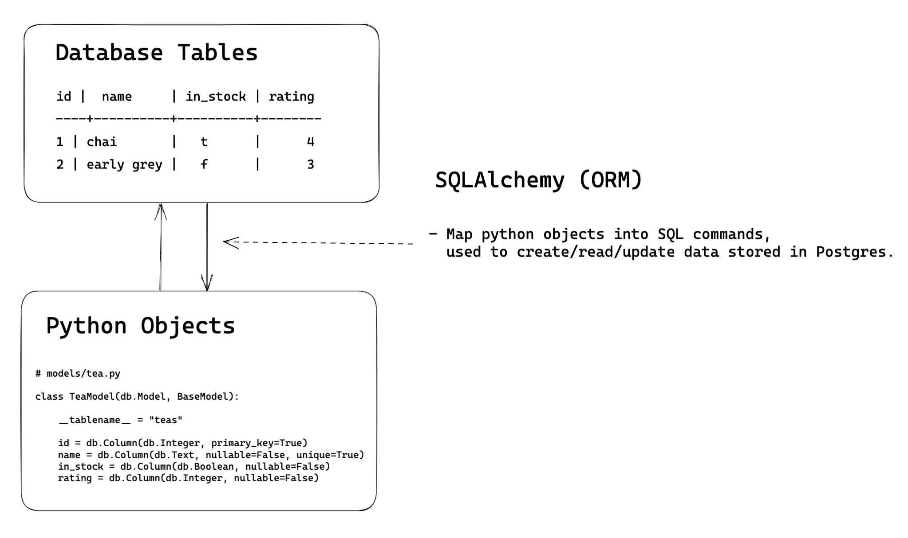

<h1>
  FastAPI SQLAlchemy Models
  Concepts
</h1>

**Learning objective:** By the end of this lesson, you will be able to **understand** the purpose of SQLAlchemy models in a Python application.

## What is SQLAlchemy?

[SQLAlchemy](https://www.sqlalchemy.org/) is a tool that helps Python developers interact with databases more easily. It is called an Object-Relational Mapper (ORM) because it "maps" (or translates) data stored in a database into Python objects, and vice versa.

**What Does That Mean?**

- Normally, to work with a database, you would write SQL queries to add, retrieve, update, or delete data.

- With SQLAlchemy, you don’t need to write SQL directly. Instead, you can work with Python objects, and SQLAlchemy will handle the behind-the-scenes process of translating your actions into SQL statements.

Here's a visual of how this works:

**_SQL Records (rows in a database) ↔ Python Objects (instances of classes in Python)_**

SQLAlchemy takes care of the complex details of communicating with the database so you can focus on writing Python code to manipulate data.

## Why use SQLAlchemy?

| Benefit             | Description                                                                                                                 |
| ------------------- | --------------------------------------------------------------------------------------------------------------------------- |
| **Simplicity**      | Interact with your database using Python code instead of raw SQL.                                                           |
| **Maintainability** | Easier to read and maintain, with less complex SQL embedded in the code.                                                    |
| **Portability**     | Switching databases (ex: from SQLite to PostgreSQL) is simpler because your code is less dependent on specific SQL dialects |
| **Safety**          | Protects against SQL injection attacks by using parameterized queries.                                                      |

### Next steps: Preparing the data layer of the API

1. First, we're going to be writing some `models` to represent our Tea data using SQLAlchemy.

2. Then we're then going to be writing a small Python script, called `seed.py`. This little program will be able to put some initial data into our SQL Database, using our `models`.

Let's get started!
